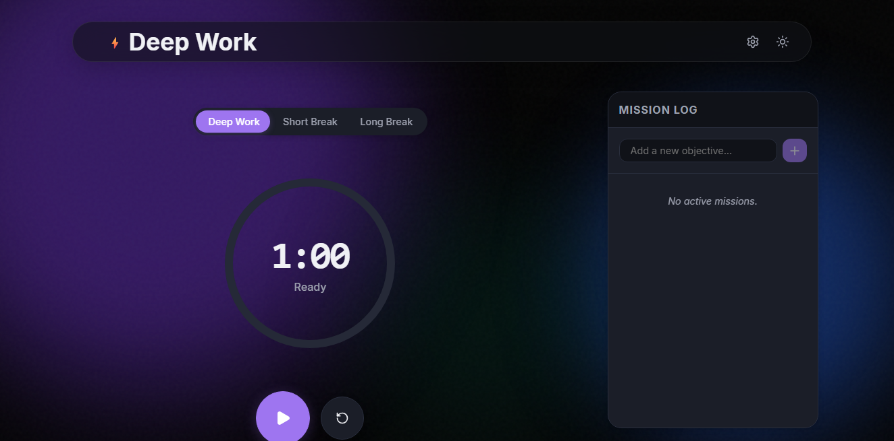

# ⚡ Deep Work Timer

A premium, aesthetic, and feature-rich Pomodoro timer designed for deep focus sessions. Built with React and Vite, it combines powerful productivity tracking with immersive visuals to keep you in the zone.


*(Note: Add a screenshot of the app here)*

## ✨ Features

### ⏱️ Smart Timer
- **Flexible Modes**: Seamlessly switch between **Deep Work**, **Short Break**, and **Long Break**.
- **Customizable**: Adjust timer durations to fit your unique workflow via the Settings menu.
- **Dynamic Tab Title**: Track your remaining time directly from the browser tab (e.g., `24:59 - Deep Work`).
- **Zen Notifications**: Gentle custom sound notifications (`.mp3`) when your session ends.

### 🌌 Immersive Visuals
- **Ambient Aurora**: Dynamic background that shifts colors based on your current mode (Cosmic Purple for Focus, Zen Teal for Breaks).
- **Focus Galaxy**: A stunning interactive particle system that visualizes your accumulated focus time as a growing galaxy of stars.
- **Glassmorphism UI**: Modern, translucent interface with a floating header and smooth view transitions.
- **Confetti Celebration**: rewarding animations when you complete tasks.

### 📊 Productivity Tracking
- **Task List**: Integrated sidebar to manage your daily goals. Tasks automatically log to your stats upon completion.
- **Commit Graph**: GitHub-style heatmap showing your daily focus intensity over the last year.
- **Transparency Card**: Generate and download a beautiful summary card of your stats to share on social media.

### 📱 Fully Responsive
- **Mobile-First**: Adapted layout with a specific robust header for mobile devices (`position: fixed`).
- **Desktop Sidebar**: Specialized two-column layout for larger screens.

## 🛠️ Tech Stack

- **Core**: React 18, Vite
- **Styling**: Vanilla CSS (Variables, Flexbox/Grid, Glassmorphism techniques)
- **Icons**: Lucide React
- **Effects**: HTML5 Canvas (Galaxy), Canvas Confetti
- **Audio**: Web Audio API / HTML5 Audio

## 🚀 Getting Started

1.  **Clone the repository**
    ```bash
    git clone https://github.com/yourusername/pomodoro-logger.git
    cd pomodoro-logger
    ```

2.  **Install dependencies**
    ```bash
    npm install
    ```

3.  **Run the development server**
    ```bash
    npm run dev
    ```

4.  **Build for production**
    ```bash
    npm run build
    ```

## 🎨 Customization

- **Themes**: Toggle between Light and Dark modes.
- **Sounds**: Replace `public/sounds/bell-notification.mp3` with your preferred audio file.

## 📄 License

MIT License. Feel free to fork and make it your own!
